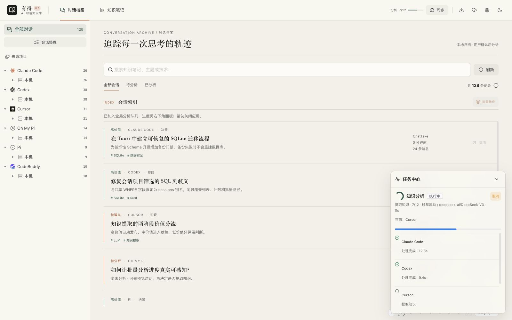
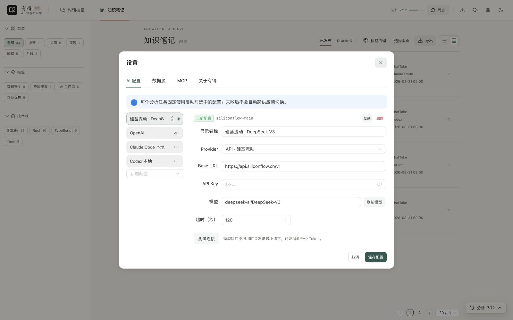
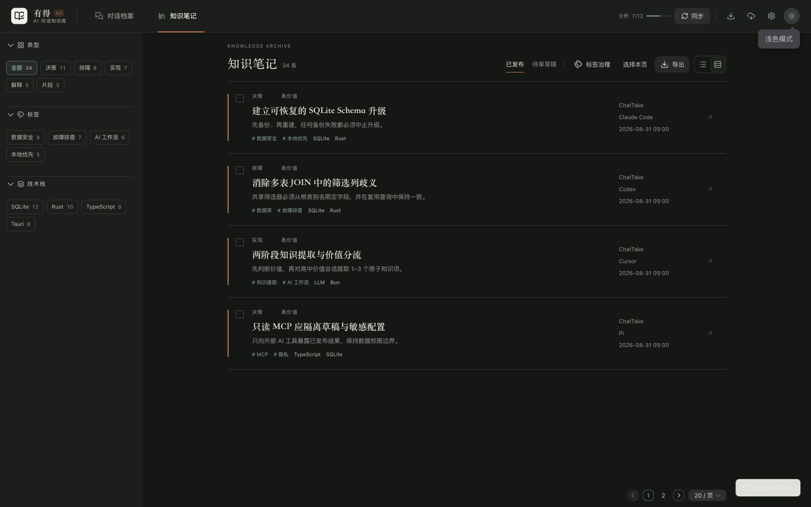

# 有得 · ChatTake

> 让每次 AI 对话，都有所得
> ChatTake — Turn AI chats into reusable knowledge

## 简介

有得是一款本地优先的 AI 对话知识库。它增量采集 Claude Code、Cursor、Codex、CodeBuddy、Grok、OMP、Pi 的本地对话，经用户确认后通过 API 或本地 CLI Provider 提取原子知识，并提供草稿治理、全文检索和只读 MCP 回溯。

v0.2.0 采用固定的五类知识（决策、排障、实现、解释、片段）与开放标签，避免 AI 无限生成分类。高价值知识自动发布，中价值进入草稿，重新分析不会覆盖旧知识。



<sub>截图由当前 v0.2.0 界面使用演示数据渲染，不包含真实会话、路径或密钥。</sub>

## v0.2.0 核心能力

- **七类对话来源**：Claude Code、Cursor、Codex、CodeBuddy、Grok、OMP、Pi；增量扫描不自动消耗 Token。
- **API 与 CLI 同级 Provider**：可保存多套 OpenAI、DeepSeek、Moonshot、智谱、硅基流动、OpenAI-compatible 或本地 CLI 配置。
- **可控的分析任务**：每个任务绑定启动时的 Provider，展示真实阶段、进度、当前会话、模型和失败项。
- **本地搜索与 MCP**：SQLite FTS5 支持中英文检索；MCP 只读已发布知识，不暴露草稿、API Key 或 Provider 配置。

## 下载与系统要求

v0.2.0 当前正式发布目标为 **macOS**，GitHub Release 同时生成：

- Apple Silicon（arm64）：`aarch64` DMG
- Intel Mac：`x86_64` DMG

请从 [GitHub Releases](https://github.com/CodeHourra/chattake/releases) 下载与芯片匹配的安装包，打开 DMG 后将 ChatTake 拖入「应用程序」。Windows/Linux 尚未进入 v0.2.0 自动发布矩阵。

安装包采用 **Ad Hoc 签名、未公证分发**。首次启动若被 Gatekeeper 拦截，请先尝试打开一次，再进入「系统设置 → 隐私与安全性」，点击「仍要打开」并确认；之后可正常双击启动。

## 首次使用

1. **启用数据源**：打开「设置 → 数据源」，确认本机已安装的 AI 工具与扫描目录。启动扫描只检测变化并写入本地 SQLite，不会调用模型。
2. **同步会话**：点击顶栏「同步」，再从「进度中心」查看扫描、解析、写入进度和失败文件；取消会在当前文件处理完成后生效。
3. **配置分析 Provider**：打开「设置 → AI 配置」，新增 API 或 CLI 配置并设为当前，同时按本机和 Provider 承载能力设置 1–8 个全局并行分析。API 支持刷新模型列表或手填完整模型 ID；CLI 的「检测命令」只检查可执行性，不调用模型。
4. **确认并开始分析**：在「对话档案」预览会话，选择单条或批量分析。运行期间不会自动跨 Provider 切换；失败后可为单项选择其他配置重试。
5. **审核与复用知识**：在「知识笔记」中编辑类型、摘要、正文、主题标签和技术项。可全文搜索、合并标签、发布草稿，或将选中/全部知识导出为 Markdown。



## 知识库

知识页支持 Light/Dark 主题、发布/草稿分流、类型/主题/技术筛选和紧凑/舒展两种密度。默认检索范围只包含已发布知识。



## 本地数据与安全

| 内容 | 默认路径 |
|---|---|
| 应用配置 | `~/.chattake/config.toml` |
| SQLite 数据库 | `~/.chattake/db/chattake.db` |
| 升级前备份 | `~/.chattake/db/backups/` |
| 全局 Sidecar/MCP 候选目录 | `~/.chattake/bin/` |

- API Key 仅保存在本地配置文件，不写入任务表、日志或 MCP 返回值。
- 分析任务保存 Provider/模型快照，不会因运行期间修改当前配置而改变。
- v0.2.0 遇到旧 Schema 时会先执行 SQLite `VACUUM INTO` 备份；任何备份失败都会中止重建。

## 技术栈

- **桌面框架**: Tauri 2.0
- **前端**: Vue 3 + TypeScript + UnoCSS + Naive UI + Pinia
- **后端**: Rust (rusqlite, serde, tokio)
- **LLM Sidecar**: TypeScript + Bun（OpenAI-compatible API / 本地 CLI）
- **MCP Server**: 官方 TypeScript SDK v2 + Bun（只读 stdio）

## 项目结构

```
chattake/
├── CHANGELOG.md           # 更新日志（唯一维护源，关于页经 sync:changelog 同步）
├── scripts/               # 根目录脚本（如 sync-changelog.mjs）
├── apps/desktop/          # Tauri 桌面应用
│   ├── src-tauri/         # Rust 后端
│   └── src/               # Vue 3 前端
├── packages/
│   ├── sidecar/           # TS Sidecar（LLM 调用 + 知识提炼）
│   ├── mcp-server/        # MCP Server（AI IDE 集成）
│   └── shared/            # 共享类型和工具
└── docs/                  # 文档
```

## 开发

```bash
# 安装依赖
bun install

# 更新日志：编辑根目录 CHANGELOG.md 后同步到关于页数据源（构建 tauri 前也会自动执行）
bun run sync:changelog

# 启动开发模式
bun --cwd apps/desktop run tauri dev

# 验证 Sidecar、MCP、Rust 与前端
bun run verify

# 统一 debug 构建（先编译伴随程序、运行 Rust 测试，再执行 Tauri）
bun run build:debug
```

## 配置

配置默认保存到 `~/.chattake/config.toml`。可同时保存 OpenAI-compatible API 与 Claude Code、Codex、Cursor、Grok、OMP、Pi、CodeBuddy CLI 配置；每个分析任务只绑定启动时选择的一套 Provider，不自动切换。完整示例见 [`docs/config.example.toml`](docs/config.example.toml)。

首次运行 v0.2.0 时，如果检测到旧 Schema，会先通过 SQLite `VACUUM INTO` 备份到 `~/.chattake/db/backups/`，备份成功后才重建数据库。

## MCP

先执行 `bun run build:companions`，然后在应用「设置 → MCP」复制配置片段。`chattake-mcp` 只读取已发布知识；草稿、任务、API Key 和供应商配置不会通过 MCP 返回。

## 许可证

MIT
