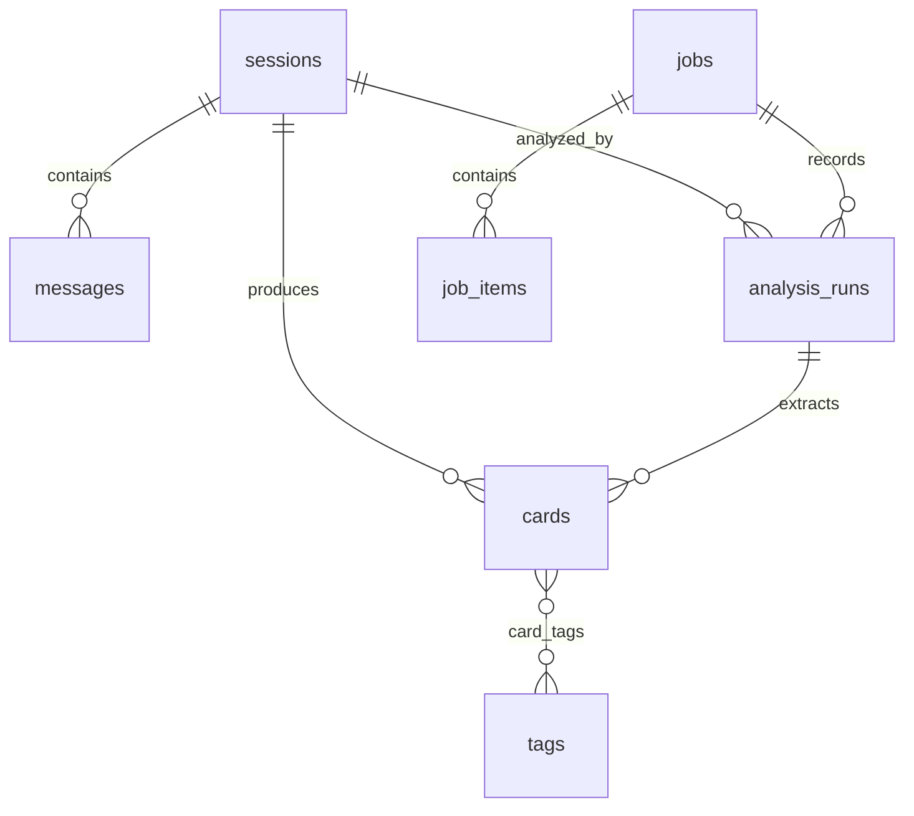

# 有得（ChatTake）SQLite 数据模型

> 当前版本：Schema v7 / 有得 v0.2.0。权威 DDL 位于 `apps/desktop/src-tauri/src/storage/migrations.rs`。

## 连接与升级

- 默认数据库：`~/.chattake/db/chattake.db`。
- 桌面端使用一个串行写连接；列表、搜索和详情使用短生命周期只读连接。
- SQLite 开启 `foreign_keys=ON`、WAL 和 5 秒 `busy_timeout`。
- v1–v6 升级到 v7 前，先用 `VACUUM INTO` 备份到 `~/.chattake/db/backups/`；备份失败立即中止，v7 允许随后重建。
- MCP 以 `query_only=ON` 打开 `CHATTAKE_DB` 或默认数据库，不执行迁移。

## 实体关系

| 表 | 关键字段与约束 | 用途 |
|---|---|---|
| `sessions` | `UNIQUE(source_id, external_session_id, source_host)`；原文件 mtime/size、内容哈希、更新时间索引 | 标准化来源会话与增量指纹 |
| `messages` | `UNIQUE(session_id, seq_order)`；级联删除 | user/assistant 可见消息及稳定顺序 |
| `cards` | 五类 `type`；`value=high|medium`；`publication_status=draft|published` | 原子知识、草稿与人工编辑保护 |
| `tags` | `UNIQUE(kind, normalized_name)`；`kind=topic|technology` | 主题与技术项词典 |
| `card_tags` | 联合主键 `(card_id, tag_id)` | 卡片与标签多对多关系 |
| `jobs` | 六种任务状态；取消标记；供应商/模型快照 | 同步与分析任务总览 |
| `job_items` | 会话/文件、阶段、耗时、错误 | 文件级或会话级进度与重试 |
| `analysis_runs` | Prompt 版本、内容哈希、配置 ID、Base URL 主机名、两阶段 Token、错误 | 单次分析审计，不存 API Key |
| `cards_fts` | `title, summary, note, tags, technologies`；trigram tokenizer | 中英文全文检索与命中片段 |

## 核心约束

- 卡片类型固定为 `decision`、`troubleshooting`、`implementation`、`explanation`、`snippet`，数据库拒绝其他值。
- 主题和技术项均通过 `tags/card_tags` 维护，不再使用逗号字符串。
- 发布状态是桌面检索和 MCP 查询的硬过滤条件；草稿不会被 MCP 读取。
- 合并标签在一个写事务中转移关系、去重并重建受影响的 FTS 行。
- `jobs` 可保存完整 Base URL 作为任务启动快照；`analysis_runs` 只保存其主机名；API Key 不进入任何表。

## 索引

- 会话：来源+更新时间、项目、状态+更新时间。
- 消息：会话+顺序。
- 卡片：会话+发布状态、类型+发布状态、价值+发布状态。
- 任务：状态+创建时间、任务项的任务+状态。
- 分析：会话+创建时间。

## 删除的 v0.1 表和字段

v7 不再包含 `sources`、`categories`、旧 `sync_log`、独立 `token_usage`，也不包含卡片上的 `memory`、`skill`、`category_id` 或逗号分隔 `tech_stack`。数据源启用状态和扫描目录属于本地 TOML 配置。
